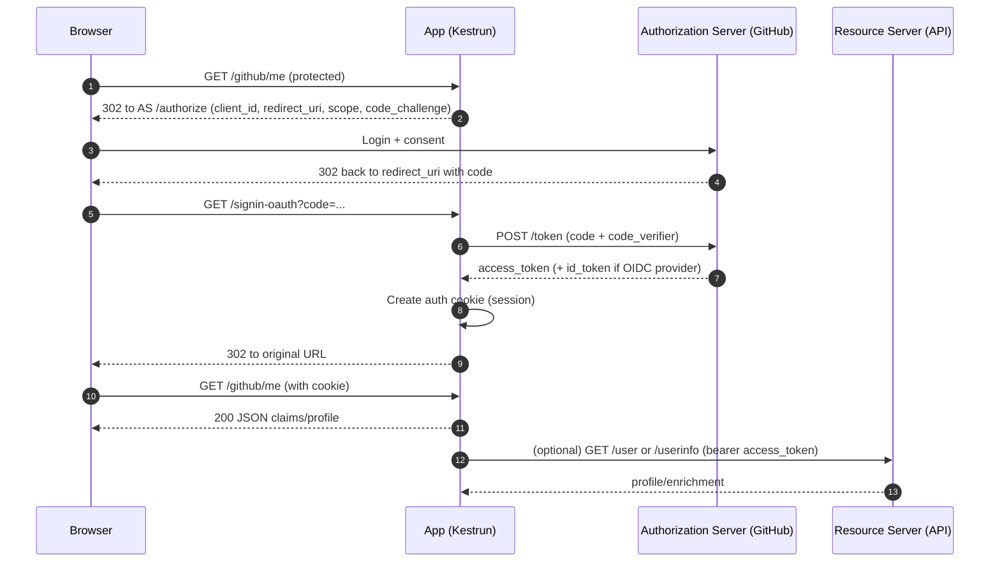

# OAuth 2.0

OAuth 2.0 is a framework for delegated authorization: users grant apps access to resources without sharing passwords.
For user sign‑in via third‑party providers (e.g., GitHub), use Authorization Code with PKCE and store resulting tokens in a cookie‑backed session.

> OAuth 2.0 handles access; you still need a local session to persist the login in your app.

---

## 1. Core Concepts & Components

| Concept/Role         | Description                                                                                |
|----------------------|--------------------------------------------------------------------------------------------|
| Authorization Server | Issues codes and tokens; handles user authorization                                       |
| Client (Your App)    | The application requesting access on behalf of the user                                   |
| Resource Owner       | The user                                                                                   |
| Resource Server      | API holding protected resources                                                             |
| Authorization Code   | One‑time code exchanged for tokens                                                          |
| PKCE                 | Protects public clients during code exchange                                                |
| Scope                | Access permissions requested (e.g., `read:user`)                                           |
| Redirect URI         | Callback registered in the provider (e.g., `/signin-oauth`)                                |
| Policy Scheme        | Kestrun scheme that authenticates via cookie and forwards challenges to the provider        |

### 1.2 Choosing OAuth2 vs OIDC

> When to choose which?
>
> - Use OIDC when you need identity (ID Token, standard claims like `sub`, `email`, `name`).
> - Use OAuth 2.0 when you only need delegated API access and plan to enrich identity from a provider API.
> - Many modern providers (Azure AD, Google) are OIDC-capable; prefer OIDC for predictable identity semantics.
> - Kestrun supports both; policy schemes keep your routes the same regardless of the backing provider.

### 1.1 Authorization Code + PKCE (flow)



---

## 2. Quick start (Generic OAuth 2.0)

Use the generic OAuth 2.0 cmdlet to configure any provider (example below uses GitHub endpoints):

```powershell
# Configure your OAuth App first; set env vars for secrets
$env:GITHUB_CLIENT_ID = 'your-client-id'
$env:GITHUB_CLIENT_SECRET = 'your-client-secret'

New-KrServer -Name 'OAuth2 Demo'
Add-KrEndpoint -Port 5000 -IPAddress ([IPAddress]::Loopback) -SelfSignedCert

# Build generic OAuth 2.0 options
$options = [Kestrun.Authentication.OAuth2Options]::new()
$options.ClientId = $env:GITHUB_CLIENT_ID
$options.ClientSecret = $env:GITHUB_CLIENT_SECRET
$options.CallbackPath = '/signin-oauth'
$options.UsePkce = $true
$options.SaveTokens = $true
$options.AuthorizationEndpoint = 'https://github.com/login/oauth/authorize'
$options.TokenEndpoint = 'https://github.com/login/oauth/access_token'
$options.UserInformationEndpoint = 'https://api.github.com/user'
$options.Scope.Clear(); $options.Scope.Add('read:user'); $options.Scope.Add('user:email') | Out-Null

# Register OAuth2 (adds 'GitHub', 'GitHub.Cookies', 'GitHub.Policy')
Add-KrOAuth2Authentication -AuthenticationScheme 'GitHub' -Options $options

Enable-KrConfiguration

# Public landing (optional)
Add-KrHtmlTemplateRoute -Pattern '/' -HtmlTemplatePath './Assets/wwwroot/github/github-auth.html'

# Protected routes (policy scheme)
Add-KrMapRoute -Verbs Get -Pattern '/github/login' -AuthorizationScheme 'GitHub' -ScriptBlock {
  Write-KrTextResponse 'Welcome via OAuth2 (GitHub)'
}

Add-KrMapRoute -Verbs Get -Pattern '/github/me' -AuthorizationScheme 'GitHub' -ScriptBlock {
  $claims = foreach ($c in $Context.User.Claims) { @{ Type = $c.Type; Value = $c.Value } }
  Write-KrJsonResponse @{ authenticated = $true; claims = $claims }
}

Add-KrMapRoute -Verbs Get -Pattern '/github/logout' -ScriptBlock {
  Invoke-KrCookieSignOut -AuthKind 'OAuth2' -Scheme 'GitHub' -RedirectUri '/'
}

Start-KrServer -CloseLogsOnExit
```

> Note: For GitHub, a convenience wrapper `Add-KrGitHubAuthentication` preconfigures endpoints, PKCE, default scopes,
> optional email enrichment, and normalizes common claims
> (maps GitHub user and emails into standard claims).
> Prefer `Add-KrOAuth2Authentication` for portability across providers.

### 2.1 Quick start (Google example)

```powershell
# Google OAuth 2.0 (OIDC-compatible) using generic options
$env:GOOGLE_CLIENT_ID = 'your-client-id'
$env:GOOGLE_CLIENT_SECRET = 'your-client-secret'

New-KrServer -Name 'Google OAuth'
Add-KrEndpoint -Port 5000 -IPAddress ([IPAddress]::Loopback) -SelfSignedCert

$opt = [Kestrun.Authentication.OAuth2Options]::new()
$opt.ClientId = $env:GOOGLE_CLIENT_ID
$opt.ClientSecret = $env:GOOGLE_CLIENT_SECRET
$opt.CallbackPath = '/signin-oauth'
$opt.UsePkce = $true
$opt.SaveTokens = $true
$opt.AuthorizationEndpoint = 'https://accounts.google.com/o/oauth2/v2/auth'
$opt.TokenEndpoint = 'https://oauth2.googleapis.com/token'
$opt.UserInformationEndpoint = 'https://openidconnect.googleapis.com/v1/userinfo'
$opt.Scope.Clear(); $null = $opt.Scope.Add('openid'); $null = $opt.Scope.Add('email'); $null = $opt.Scope.Add('profile')

Add-KrOAuth2Authentication -AuthenticationScheme 'Google' -Options $opt

Enable-KrConfiguration

Add-KrMapRoute -Verbs Get -Pattern '/google/me' -AuthorizationScheme 'Google' -ScriptBlock {
  $claims = foreach ($c in $Context.User.Claims) { @{ Type = $c.Type; Value = $c.Value } }
  Write-KrJsonResponse @{ provider = 'google'; authenticated = $true; claims = $claims }
}

Start-KrServer -CloseLogsOnExit
```

### 2.2 Quick start (GitLab example)

```powershell
# GitLab OAuth 2.0 using generic options
$env:GITLAB_CLIENT_ID = 'your-client-id'
$env:GITLAB_CLIENT_SECRET = 'your-client-secret'

New-KrServer -Name 'GitLab OAuth'
Add-KrEndpoint -Port 5000 -IPAddress ([IPAddress]::Loopback) -SelfSignedCert

$gitlab = [Kestrun.Authentication.OAuth2Options]::new()
$gitlab.ClientId = $env:GITLAB_CLIENT_ID
$gitlab.ClientSecret = $env:GITLAB_CLIENT_SECRET
$gitlab.CallbackPath = '/signin-oauth'
$gitlab.UsePkce = $true
$gitlab.SaveTokens = $true
$gitlab.AuthorizationEndpoint = 'https://gitlab.com/oauth/authorize'
$gitlab.TokenEndpoint = 'https://gitlab.com/oauth/token'
$gitlab.UserInformationEndpoint = 'https://gitlab.com/api/v4/user'
$gitlab.Scope.Clear(); $null = $gitlab.Scope.Add('read_user')

Add-KrOAuth2Authentication -AuthenticationScheme 'GitLab' -Options $gitlab

Enable-KrConfiguration

Add-KrMapRoute -Verbs Get -Pattern '/gitlab/me' -AuthorizationScheme 'GitLab' -ScriptBlock {
  $claims = foreach ($c in $Context.User.Claims) { @{ Type = $c.Type; Value = $c.Value } }
  Write-KrJsonResponse @{ provider = 'gitlab'; authenticated = $true; claims = $claims }
}

Start-KrServer -CloseLogsOnExit
```

### 2.3 Quick start (Azure AD example)

```powershell
# Azure AD (Microsoft Identity Platform) using generic OAuth 2.0 options
$tenant = 'common' # or your tenant ID (e.g., 'contoso.onmicrosoft.com' or GUID)
$env:AZURE_AD_CLIENT_ID = 'your-client-id'
$env:AZURE_AD_CLIENT_SECRET = 'your-client-secret'

New-KrServer -Name 'Azure AD OAuth'
Add-KrEndpoint -Port 5000 -IPAddress ([IPAddress]::Loopback) -SelfSignedCert

$aad = [Kestrun.Authentication.OAuth2Options]::new()
$aad.ClientId = $env:AZURE_AD_CLIENT_ID
$aad.ClientSecret = $env:AZURE_AD_CLIENT_SECRET
$aad.CallbackPath = '/signin-oauth'
$aad.UsePkce = $true
$aad.SaveTokens = $true
$aad.AuthorizationEndpoint = "https://login.microsoftonline.com/$tenant/oauth2/v2.0/authorize"
$aad.TokenEndpoint = "https://login.microsoftonline.com/$tenant/oauth2/v2.0/token"
$aad.UserInformationEndpoint = 'https://graph.microsoft.com/v1.0/me'
$aad.Scope.Clear(); $null = $aad.Scope.Add('User.Read'); $null = $aad.Scope.Add('offline_access')

Add-KrOAuth2Authentication -AuthenticationScheme 'AzureAD' -Options $aad

Enable-KrConfiguration

Add-KrMapRoute -Verbs Get -Pattern '/azuread/me' -AuthorizationScheme 'AzureAD' -ScriptBlock {
  $claims = foreach ($c in $Context.User.Claims) { @{ Type = $c.Type; Value = $c.Value } }
  Write-KrJsonResponse @{ provider = 'azuread'; authenticated = $true; claims = $claims }
}

Start-KrServer -CloseLogsOnExit
```

---

## 3. Endpoints & Tokens

- Authorization: `/authorize` → user login + consent; returns `code`
- Token: `/token` → exchange `code` for `access_token` (+ `id_token` for OIDC providers, `refresh_token` if enabled)
- Provider APIs: `/user`, `/user/emails` (GitHub) for enrichment when permitted by scope

Tokens:

- Access Token: presented to APIs; not identity by itself; may be opaque or JWT
- Refresh Token: long‑lived token to obtain new access tokens (web apps should treat carefully)

### 3.1 Provider checklist

| Item                  | Description                                        | Example(s) |
|-----------------------|----------------------------------------------------|------------|
| AuthorizationEndpoint | Where the browser is redirected to sign in         | `https://github.com/login/oauth/authorize` |
| TokenEndpoint         | Backend exchange of code → tokens                  | `https://github.com/login/oauth/access_token` |
| UserInfo/Profile API  | Optional enrichment endpoint                       | `https://api.github.com/user` |
| CallbackPath          | Redirect URI path registered in the app            | `/signin-oauth` |
| Scopes                | Permissions requested                              | GitHub: `read:user`, `user:email`; Google: `openid email profile` |
| Common claims         | Useful fields to map                               | `sub`, `name`, `email`, provider-specific IDs |

## 4. Scopes & enrichment

- Typical default scopes: `read:user`, `user:email` (for GitHub). Add with `-Scope`.
- Email enrichment: wrapper can fetch primary/verified emails if missing and permitted by scope; disable via `-DisableEmailEnrichment`.

## 5. Protecting routes

- Use `-AuthorizationScheme 'GitHub'` (policy scheme) on protected endpoints.
- Unauthenticated requests are challenged (302 to GitHub); authenticated requests use the session cookie.

## 6. Custom providers

- Use [Add-KrOAuth2Authentication](/pwsh/cmdlets/Add-KrOAuth2Authentication) to configure arbitrary providers.
- Set `AuthorizationEndpoint`, `TokenEndpoint`, `ClientId`, `ClientSecret`, `CallbackPath`, and `Scope`.
- Optionally enable `SaveTokens`, `UsePkce`, and add `GetClaimsFromUserInfoEndpoint` if the provider supports a userinfo endpoint.

## 7. Troubleshooting

| Symptom                         | Cause                                | Resolution                                                      |
|---------------------------------|--------------------------------------|-----------------------------------------------------------------|
| Callback mismatch               | App uses different path              | Set `-CallbackPath` to match and update app settings            |
| No email claim                  | Scope not granted / email private    | Include `user:email` scope and ensure account has a primary     |
| Infinite redirect loop          | Cookie blocked or wrong scheme       | Allow cookies; use `-AuthorizationScheme 'GitHub'`              |
| 401 after login                 | Session lost                         | Same-site or domain issues; test in a fresh profile             |

## 8. Security best practices

- Use HTTPS always; development can rely on a self-signed cert for local testing.
- Keep client secrets out of source control; prefer environment variables or secret stores.
- Request minimal scopes; avoid over-broad access.
- Validate redirect URIs and add CSRF protections if you add custom state parameters.

### 8.1 Provider setup checklist

- Register an OAuth app (web application) at the provider
- Add exact redirect URI (default is `/signin-oauth` on your host/port)
- Create client secret and keep it out of source (env vars)
- Identify endpoints: `AuthorizationEndpoint`, `TokenEndpoint`, and any `UserInformationEndpoint`
- Enable PKCE and save tokens when appropriate for your app
- Start minimal: request least scopes; add enrichment scopes as needed

## 9. References

- Cmdlets:
  - [Add-KrOAuth2Authentication](/pwsh/cmdlets/Add-KrOAuth2Authentication)
  - [Add-KrGitHubAuthentication](/pwsh/cmdlets/Add-KrGitHubAuthentication)
  - [Invoke-KrChallenge](/pwsh/cmdlets/Invoke-KrChallenge)
  - [Invoke-KrCookieSignOut](/pwsh/cmdlets/Invoke-KrCookieSignOut)
  - [Add-KrMapRoute](/pwsh/cmdlets/Add-KrMapRoute)
- Tutorials:
  - [GitHub Authentication](/pwsh/tutorial/8.authentication/11.GitHub-Authentication)
- Specs:
  - [OAuth 2.0 RFC 6749](https://www.rfc-editor.org/rfc/rfc6749)
  - [OAuth 2.0 for Native Apps (RFC 8252)](https://www.rfc-editor.org/rfc/rfc8252)
  - [PKCE (RFC 7636)](https://www.rfc-editor.org/rfc/rfc7636)
  - [OAuth 2.1 (draft)](https://oauth.net/2.1/)
  - [OWASP OAuth 2.0 Cheat Sheet](https://cheatsheetseries.owasp.org/cheatsheets/OAuth2_Cheat_Sheet.html)

---

Return to the [Authentication index](./index).
