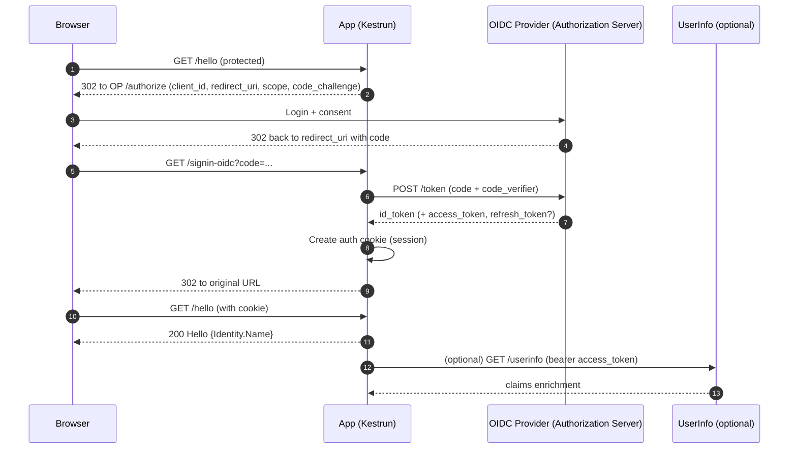

# OpenID Connect (OIDC)

OpenID Connect adds identity to OAuth 2.0: after an Authorization Code flow, the app receives an ID Token (a JWT) describing the user
and typically an Access Token for calling APIs. In Kestrun you protect routes with a policy scheme that authenticates via cookie and
forwards challenges to the OIDC provider.

> Quick intuition: OAuth 2.0 grants access, OIDC tells you who the user is.

---

## 1. Core Concepts & Components

| Concept/Role         | Description                                                                                |
|----------------------|--------------------------------------------------------------------------------------------|
| Authorization Server | The OIDC Provider (OP) that authenticates users and issues tokens                         |
| Relying Party (RP)   | Your application (Kestrun server) relying on the OP for identity                          |
| Resource Owner       | The user                                                                                   |
| Authorization Code   | One‑time code exchanged for tokens at the token endpoint                                   |
| PKCE                 | Proof Key for Code Exchange — protects public clients during code exchange                 |
| ID Token             | JWT with identity claims (sub, name, email, etc.) for the signed‑in user                   |
| Access Token         | Token (JWT or opaque) to call APIs; not identity by itself                                 |
| Policy Scheme        | Kestrun scheme that authenticates via cookie and forwards challenges to OIDC                |
| Callback Path        | Redirect URI path registered in the provider (e.g., `/signin-oidc`)                        |

### 1.1 Authorization Code + PKCE (high-level flow)



---

### 1.2 Choosing OAuth2 vs OIDC

> When to choose which?
>
> - Choose OIDC when you want standardized identity via `id_token` and claims (`sub`, `email`, `name`).
> - Choose OAuth 2.0 if you only need API access and will enrich identity via provider APIs.
> - If a provider supports OIDC (Azure AD, Google), prefer OIDC for predictable identity semantics.
> - Kestrun uses a policy scheme so protected routes stay the same regardless of the underlying auth mechanism.

## 2. Endpoints & Metadata

- Discovery: `/.well-known/openid-configuration` → returns provider metadata (issuer, endpoints, JWKS URI)
- Authorization: `/authorize` → user login + consent; returns `code`
- Token: `/token` → exchange `code` for `id_token` (+ `access_token`, `refresh_token`)
- UserInfo: `/userinfo` → optional claims enrichment using `access_token`
- JWKS: `/jwks` or `jwks_uri` → provider signing keys for token validation
- End Session: `/logout` or provider‑specific endpoint for RP‑initiated logout

Notes:

- ID Token audience is your client; Access Token audience is the API; do not use Access Tokens as identity without validation.
- Name mapping: set `$options.TokenValidationParameters.NameClaimType = 'name'` to populate `Identity.Name` in Kestrun.

## 3. Quick start (PowerShell)

```powershell
# Options object (explicit control) or use parameters on Add-KrOpenIdConnectAuthentication
$options = [Kestrun.Authentication.OidcOptions]::new()
$options.Authority = 'https://demo.duendesoftware.com'
$options.ClientId = 'interactive.confidential'
$options.ClientSecret = 'secret'
$options.ResponseType = [Microsoft.IdentityModel.Protocols.OpenIdConnect.OpenIdConnectResponseType]::Code
$options.UsePkce = $true
$options.SaveTokens = $true
$options.GetClaimsFromUserInfoEndpoint = $true
$options.TokenValidationParameters.NameClaimType = 'name'
$options.Scope.Clear(); $options.Scope.Add('openid'); $options.Scope.Add('profile'); $options.Scope.Add('email') | Out-Null

# Server + HTTPS listener
New-KrServer -Name 'OIDC'
Add-KrEndpoint -Port 5000 -IPAddress ([IPAddress]::Loopback) -SelfSignedCert

# Register OIDC (adds 'oidc', 'oidc.Cookies', 'oidc.Policy')
Add-KrOpenIdConnectAuthentication -AuthenticationScheme 'oidc' -Options $options

Enable-KrConfiguration

# Routes
Add-KrMapRoute -Verbs Get -Pattern '/' -ScriptBlock { Write-KrTextResponse 'Home' }
Add-KrMapRoute -Verbs Get -Pattern '/login' -ScriptBlock { Invoke-KrChallenge -Scheme 'oidc' -RedirectUri '/hello' } -AllowAnonymous
Add-KrMapRoute -Verbs Get -Pattern '/hello' -AuthorizationScheme 'oidc' -ScriptBlock {
  Write-KrJsonResponse @{ hello = $Context.User.Identity.Name; authenticated = $true }
}
Add-KrMapRoute -Verbs Get -Pattern '/logout' -AllowAnonymous -ScriptBlock {
  $scheme = 'oidc'
  $uri = ("https://{0}/" -f $Context.Request.Host.Value)
  Invoke-KrCookieSignOut -Scheme $scheme -AuthKind Oidc -RedirectUri $uri
}

Start-KrServer -CloseLogsOnExit
```

---

### 3.1 Quick start (Azure AD example)

```powershell
# Azure AD (Microsoft Identity Platform) OIDC example
$tenant = 'common' # or your tenant ID (GUID or domain)

$options = [Kestrun.Authentication.OidcOptions]::new()
$options.Authority = "https://login.microsoftonline.com/$tenant/v2.0"
$options.ClientId = $env:AZURE_AD_CLIENT_ID
$options.ClientSecret = $env:AZURE_AD_CLIENT_SECRET
$options.ResponseType = [Microsoft.IdentityModel.Protocols.OpenIdConnect.OpenIdConnectResponseType]::Code
$options.UsePkce = $true
$options.SaveTokens = $true
$options.GetClaimsFromUserInfoEndpoint = $false # Microsoft Graph is used for enrichment instead
$options.TokenValidationParameters.NameClaimType = 'name'
$options.Scope.Clear(); $options.Scope.Add('openid'); $options.Scope.Add('profile'); $options.Scope.Add('email') | Out-Null

New-KrServer -Name 'OIDC AzureAD'
Add-KrEndpoint -Port 5000 -IPAddress ([IPAddress]::Loopback) -SelfSignedCert

Add-KrOpenIdConnectAuthentication -AuthenticationScheme 'azuread' -Options $options

Enable-KrConfiguration

Add-KrMapRoute -Verbs Get -Pattern '/azuread/login' -ScriptBlock { Invoke-KrChallenge -Scheme 'azuread' -RedirectUri '/azuread/me' } -AllowAnonymous
Add-KrMapRoute -Verbs Get -Pattern '/azuread/me' -AuthorizationScheme 'azuread' -ScriptBlock {
  Write-KrJsonResponse @{ name = $Context.User.Identity.Name; provider = 'azuread'; authenticated = $true }
}

Start-KrServer -CloseLogsOnExit
```

> Note: To enrich profile data (photo, groups, etc.), call Microsoft Graph with the access token.
> For example: `https://graph.microsoft.com/v1.0/me` with scope `User.Read`.

## 4. Flows and clients

- Use Authorization Code + PKCE for browsers.
- Confidential clients use a `ClientSecret`. Public clients use PKCE without a secret.
- Some providers support `private_key_jwt` (client assertion via a signing key). See tutorial `8.11-OIDC.ps1` for advanced config.

## 5. Claims and Name mapping

- Map the name claim: `$options.TokenValidationParameters.NameClaimType = 'name'` so `Identity.Name` is populated.
- Enable `GetClaimsFromUserInfoEndpoint` to enrich claims beyond the ID token (provider-dependent).

## 6. Protecting routes

- Use `-AuthorizationScheme 'oidc'` on protected routes. The policy scheme:
  - Authenticates via the cookie issued after OIDC callback.
  - Forwards challenges to OIDC when unauthenticated (login redirect).

## 7. Logout patterns

- Local logout: clear cookie using `Invoke-KrCookieSignOut -Scheme 'oidc' -AuthKind Oidc -RedirectUri '/'`.
- Provider logout: many providers require a post-logout redirect URI allowlist.

## 8. Troubleshooting

| Symptom                       | Cause                                | Resolution                                                                 |
|-------------------------------|--------------------------------------|----------------------------------------------------------------------------|
| redirect_uri not valid       | Callback path/host mismatch          | Register `https://localhost:5000/signin-oidc` (or your configured path)    |
| Empty/partial claims         | Minimal scopes                       | Add `email` or custom scopes; enable `GetClaimsFromUserInfoEndpoint`       |
| Infinite redirect loop       | Cookie blocked / scheme mismatch     | Allow cookies; use `-AuthorizationScheme 'oidc'` on protected routes       |
| 400 invalid_client           | Wrong secret / client id             | Verify `ClientId`/`ClientSecret` and application type                      |
| Name claim is null           | Claim type not mapped                | Set `TokenValidationParameters.NameClaimType = 'name'`                      |

## 9. Security best practices

- Always use HTTPS in development and production.
- Prefer Authorization Code with PKCE; avoid implicit flow.
- Keep secrets outside source (env vars, secret manager, Key Vault).
- Validate callback and post-logout URIs are exact.
- Limit scopes to least privilege; avoid over-broad userinfo.

## 10. Provider setup checklist

- Register an app in your provider (app type: web; redirect URIs allowed)
- Add an exact redirect URI (default Kestrun is `/signin-oidc` over your host/port)
- Collect `ClientId` and `ClientSecret` and store them as env vars
- Verify discovery document at `/.well-known/openid-configuration` for `issuer`, `authorization_endpoint`, `token_endpoint`, `jwks_uri`
- Choose scopes: at least `openid profile`; add `email` if needed
- Set `TokenValidationParameters.NameClaimType` (e.g., `name`) to fill `Identity.Name`
- If using RP logout, configure post-logout redirect URIs in the provider

## 11. References

- Cmdlets:
  - [Add-KrOpenIdConnectAuthentication](/pwsh/cmdlets/Add-KrOpenIdConnectAuthentication)
  - [Invoke-KrChallenge](/pwsh/cmdlets/Invoke-KrChallenge)
  - [Invoke-KrCookieSignOut](/pwsh/cmdlets/Invoke-KrCookieSignOut)
  - [Add-KrMapRoute](/pwsh/cmdlets/Add-KrMapRoute)
- Tutorials:
  - [OIDC (Duende Demo)](/pwsh/tutorial/8.authentication/12.OpenID-Connect)
  - [OIDC (Okta)](/pwsh/tutorial/8.authentication/9.OpenID-Connect-Okta)
- Specs:
  - [OpenID Connect Core](https://openid.net/specs/openid-connect-core-1_0.html)
  - [OAuth 2.0 RFC 6749](https://www.rfc-editor.org/rfc/rfc6749)

---

Return to the [Authentication index](./index).
