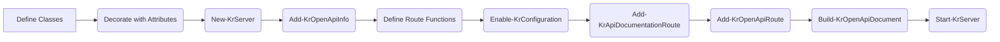

# OpenAPI Generation

End-to-end guide for generating and documenting RESTful APIs with [OpenAPI 3.0+ specifications](https://spec.openapis.org/oas/v3.1.0) using Kestrun's PowerShell
cmdlets and attributes.

Focus areas:

- **Class-based Components**: Define schemas, request bodies, and responses using PowerShell classes.
- **Attributes**: Decorate classes and properties with `[OpenApiSchemaComponent]`, `[OpenApiPropertyAttribute]`, etc.
- **Document Metadata**: Configure title, version, contact, license, and servers.
- **Operation Decorators**: Annotate route functions with `[OpenApiPath]`, `[OpenApiResponse]`, and `[OpenApiRequestBody]`.
- **Inheritance**: Reuse schemas via class inheritance.

> Kestrun uses a **code-first** approach where PowerShell classes define your data models and attributes define your API specification.

---

## 1. Concepts

| Concept              | Description                                                                    |
|----------------------|--------------------------------------------------------------------------------|
| **Schema Component** | A PowerShell class decorated with `[OpenApiSchemaComponent]`. Defines data structure. |
| **Request Body**     | A class decorated with `[OpenApiRequestBodyComponent]`. Defines payload structure. |
| **Response**         | A variable decorated with `[OpenApiResponseComponent]`. Defines a reusable response entry under `components.responses`. |
| **Parameter**        | A PowerShell parameter/variable decorated with `[OpenApiParameterComponent]`. Defines reusable parameters. |
| **Callback**         | An operation-scoped async notification defined under `paths.{path}.{verb}.callbacks` (OpenAPI 3.1). |
| **Webhook**          | A top-level OpenAPI webhook entry describing an outgoing event notification your API may send to subscribers. |
| **Tag**              | A tag entry under `tags[]` used to group operations (OpenAPI 3.2 supports `parent`, `kind`, and tag-level `externalDocs`). |
| **Property Attribute**| `[OpenApiPropertyAttribute]` on class properties defines validation, examples, and descriptions. |
| **Route Attribute**  | `[OpenApiPath]` on functions defines the HTTP method and route pattern. |
| **Callback Attribute**| `[OpenApiCallback]` / `[OpenApiCallbackRef]` on functions describe callback requests the API may send as part of an operation. |
| **Webhook Attribute**| `[OpenApiWebhook]` on functions defines a webhook and its request body schema for an event notification. |

---

## 2. Typical Workflow



---

## 3. Minimal Example

```powershell
# 1. Define a Schema
[OpenApiSchemaComponent(RequiredProperties = ('name'))]
class Pet {
    [OpenApiPropertyAttribute(Description = 'Pet ID', Example = 1)]
    [long]$id

    [OpenApiPropertyAttribute(Description = 'Pet Name', Example = 'Fido')]
    [string]$name
}

# 2. Setup Server & Metadata
$srv = New-KrServer -Name 'Pet API'
Add-KrEndpoint -Port 5000
Add-KrOpenApiInfo -Title 'Pet API' -Version '1.0.0'

# 3. Define Route
function getPet {
    [OpenApiPath(HttpVerb = 'get', Pattern = '/pets/{id}')]
    [OpenApiResponse(StatusCode = '200', Description = 'Found pet', Schema = [Pet])]
    param([int]$id)

    Write-KrJsonResponse @{ id = $id; name = 'Fido' }
}

# 4. Enable & Build
Enable-KrConfiguration
Add-KrApiDocumentationRoute -DocumentType Swagger
Add-KrOpenApiRoute

Build-KrOpenApiDocument
Start-KrServer -Server $srv
```

---

## 3.1 Webhooks (Top-level event notifications)

OpenAPI **webhooks** document event notifications that your API may send to **subscribers**.
They are **top-level** in the OpenAPI document under `webhooks` (OpenAPI 3.1).

This is different from **callbacks**, which are tied to a specific API operation.

> **Note:** OpenAPI webhooks describe the payloads and contract, but do not define how consumers subscribe.
> Subscription management is usually modeled as regular API endpoints (e.g. `POST /subscriptions`).

### 3.1.1 Define webhook payload schemas

Define payloads as schema components so webhook request bodies can reference them:

```powershell
[OpenApiSchemaComponent(RequiredProperties = ('event_id', 'event_type', 'timestamp', 'data'))]
class OrderEventPayload {
    [OpenApiPropertyAttribute(Description = 'Unique identifier for this event', Format = 'uuid')]
    [string]$event_id

    [OpenApiPropertyAttribute(Description = 'Event type', Example = 'order.created')]
    [string]$event_type

    [OpenApiPropertyAttribute(Description = 'When the event occurred', Format = 'date-time')]
    [datetime]$timestamp

    [OpenApiPropertyAttribute(Description = 'Event payload')]
    [hashtable]$data
}
```

### 3.1.2 Declare webhooks

Declare a webhook using `[OpenApiWebhook()]` and attach a request body using `[OpenApiRequestBody()]`:

```powershell
function orderCreatedWebhook {
    [OpenApiWebhook(HttpVerb = 'post', Pattern = '/webhooks/order.created')]
    param(
        [OpenApiRequestBody(Description = 'Order creation event payload')]
        [OrderEventPayload]$Body
    )
}
```

### 3.1.3 Generate & view

1. Register OpenAPI generation: `Add-KrOpenApiRoute`
1. Build and validate: `Build-KrOpenApiDocument` and `Test-KrOpenApiDocument`
1. Fetch the document and confirm `webhooks` exists:

   - `/openapi/v3.1/openapi.json`

---

## 3.2 Callbacks (Operation-scoped async notifications)

OpenAPI **callbacks** document requests that your API may send **as part of handling a specific operation**.
They live under `paths.{path}.{verb}.callbacks` and are typically driven by a **callback URL supplied by the client**
(often inside the request body).

This is different from **webhooks**, which are **top-level** event notifications that are not tied to a single operation.

### 3.2.1 Typical pattern (PowerShell)

1. The client calls an operation like `POST /v1/payments` and includes callback URLs in the request body.
2. The API documents one or more callback requests using:
   - `[OpenApiCallback]` to declare the callback operation
   - `[OpenApiCallbackRef]` to attach it to the main operation under `callbacks`

In Kestrun, callbacks can be declared inline or as reusable callback components under `components.callbacks`.

At runtime, callback URLs are resolved from a **URL template** that can contain:

- A request-body runtime expression like `{$request.body#/callbackUrls/status}` (typically a client-supplied base URL)
- Token placeholders like `{paymentId}` (populated from callback function parameters)

When you invoke a callback function, Kestrun resolves the final URL, serializes the callback body, and sends the HTTP request.

### 3.2.2 Example (payment create + callbacks)

```powershell
# Callback event payload
[OpenApiSchemaComponent(RequiredProperties = ('eventId', 'timestamp', 'paymentId', 'status'))]
class PaymentStatusChangedEvent {
    [OpenApiPropertyAttribute(Format = 'uuid')]
    [string]$eventId

    [OpenApiPropertyAttribute(Format = 'date-time')]
    [datetime]$timestamp

    [OpenApiPropertyAttribute(Example = 'PAY-12345678')]
    [string]$paymentId

    [ValidateSet('authorized', 'captured', 'failed')]
    [string]$status
}

<#
.SYNOPSIS
    Payment Status Callback (component)
.DESCRIPTION
    Provider calls the consumer back when a payment status changes.
.PARAMETER paymentId
    The ID of the payment
.PARAMETER Body
    The callback event payload
#>
function paymentStatusCallback {
    [OpenApiCallback(
        Expression = '$request.body#/callbackUrls/status',
        HttpVerb = 'post',
        Pattern = '/v1/payments/{paymentId}/status',
        Inline = $true
    )]
    param(
        [OpenApiParameter(In = 'path', Required = $true)]
        [string]$paymentId,

        [OpenApiRequestBody(ContentType = 'application/json')]
        [PaymentStatusChangedEvent]$Body
    )
}

<#
.SYNOPSIS
    Create a payment.
.DESCRIPTION
    Creates a new payment and documents callbacks.
.PARAMETER body
    Payment creation request including callback URLs.
#>
function createPayment {
    [OpenApiPath(HttpVerb = 'post', Pattern = '/v1/payments')]
    [OpenApiResponse(StatusCode = '201', Description = 'Payment created')]
    [OpenApiCallbackRef(Key = 'paymentStatus', ReferenceId = 'paymentStatusCallback', Inline = $true)]
    param(
        [OpenApiRequestBody(ContentType = 'application/json')]
        [object]$body
    )

    Write-KrJsonResponse @{ paymentId = 'PAY-12345678'; status = 'pending' } -StatusCode 201
}
```

### 3.2.3 Enabling callback automation (PowerShell)

The OpenAPI callback metadata describes callback requests your API *may* send.
To actually dispatch those callback HTTP requests at runtime from PowerShell, enable Kestrun's callback automation middleware:

```powershell
# Enable Kestrun callback automation middleware (retries/timeouts)
Add-KrAddCallbacksAutomation

# Ensure configuration runs after your callback functions are defined,
# so Kestrun can discover and register them.
Enable-KrConfiguration
```

You can configure dispatch behavior either via individual parameters:

```powershell
Add-KrAddCallbacksAutomation -DefaultTimeout 30 -MaxAttempts 5 -BaseDelay 2 -MaxDelay 60
```

…or by passing a typed options object:

```powershell
$opts = [Kestrun.Callback.CallbackDispatchOptions]::new()
$opts.DefaultTimeout = [TimeSpan]::FromSeconds(30)
$opts.MaxAttempts = 5
$opts.BaseDelay = [TimeSpan]::FromSeconds(2)
$opts.MaxDelay = [TimeSpan]::FromSeconds(60)

Add-KrAddCallbacksAutomation -Options $opts
```

At runtime, invoking a callback function (e.g. `paymentStatusCallback -PaymentId ... -Body ...`) will resolve the callback URL from the callback `Expression`
(typically a client-supplied URL in the request body), expand `{tokens}` from the callback `Pattern`, and dispatch the request.

#### 3.2.3.1 How callback URLs are resolved

The callback URL is built by combining:

1. The client-provided value referenced by your callback `Expression` (for example, `$request.body#/callbackUrls/status`)
2. The callback `Pattern` (for example, `/v1/payments/{paymentId}/status`)
3. Token values (for example, `{paymentId}`) taken from the callback function parameters by name

If the resolved URL is **absolute** (e.g. `https://client.example.com/...`), it is used as-is.
If it is **relative**, Kestrun will combine it with a default base URI (derived from the current request).

> **Warning:** When callback URLs come from client-supplied data (for example, `{$request.body#/callbackUrls/status}`), using them as-is can introduce
> server-side request forgery (SSRF) risks. A malicious client could point callback URLs at internal services or metadata endpoints
> (such as `http://169.254.169.254/` or private admin APIs), causing your server to make HTTP(S) requests into your internal network.
> In production, always validate and constrain callback targets (for example, by using a strict host/protocol allowlist via your callback
> dispatch options or a custom `ICallbackUrlResolver`, and by rejecting callback URLs that are not on approved domains or schemes).
If a required token (like `{paymentId}`) is missing, callback dispatch will fail with an error indicating the missing token.

#### 3.2.3.2 Using callbacks inside an operation

Callbacks are tied to a specific operation because they typically depend on the **same request body** that supplied the callback URLs.
A common pattern is:

1. Accept callback URLs in the operation request body.
2. Perform your main work.
3. Invoke one or more callback functions with the required path tokens and body payload.

Example shape of the request body (client side):

```powershell
$body = @{
    amount = 129.99
    currency = 'USD'
    callbackUrls = @{
        # Base URLs that the server can append the callback pattern to
        status = 'https://client.example.com/callbacks/payment-status'
        reservation = 'https://client.example.com/callbacks/reservation'
        shippingOrder = 'https://client.example.com/callbacks/shipping-order'
    }
} | ConvertTo-Json -Depth 10

Invoke-RestMethod -Uri 'http://127.0.0.1:5000/v1/payments' -Method Post -ContentType 'application/json' -Body $body
```

Example callback invocation (server side, inside your route function):

```powershell
# ... after you compute $paymentId, $orderId, and create payload objects

paymentStatusCallback -PaymentId $paymentId -Body $paymentStatusChangedEvent
reservationCallback -OrderId $orderId -Body $reservationEvent
shippingOrderCallback -OrderId $orderId -Body $shippingOrderEvent
```

### 3.2.4 Generate & view

1. Register OpenAPI generation: `Add-KrOpenApiRoute`
1. Build and validate: `Build-KrOpenApiDocument` and `Test-KrOpenApiDocument`
1. Fetch the document and confirm callbacks exist:

   - `/openapi/v3.1/openapi.json`

For a complete runnable example, see the tutorial sample `10.11-OpenAPI-Component-Callback.ps1`.

## 4. Component Schemas

Use `[OpenApiSchemaComponent]` to define reusable data models.

### 4.1 Basic Schema

```powershell
[OpenApiSchemaComponent(RequiredProperties = ('username', 'email'))]
class User {
    [OpenApiPropertyAttribute(Description = 'Unique ID', Format = 'int64', Example = 1)]
    [long]$id

    [OpenApiPropertyAttribute(Description = 'Username', Example = 'jdoe')]
    [string]$username

    [OpenApiPropertyAttribute(Description = 'Email address', Format = 'email')]
    [string]$email
}
```

### 4.2 Enums and Validation

Use PowerShell validation attributes alongside OpenAPI attributes.

```powershell
[OpenApiSchemaComponent()]
class Product {
    [OpenApiPropertyAttribute(Description = 'Product Status', Example = 'available')]
    [ValidateSet('available', 'pending', 'sold')]
    [string]$status

    [OpenApiPropertyAttribute(Minimum = 0, Maximum = 100)]
    [int]$stock
}
```

### 4.3 Arrays

To define a schema that is a list of other objects, use inheritance and the `Array` property.

```powershell
[OpenApiSchemaComponent(Description = 'List of users', Array = $true)]
class UserList : User {}
```

### 4.4 Primitive Schema Components (OpenApiString / OpenApiNumber / ...)

Kestrun supports two common ways to model **primitive** values in OpenAPI:

1. Use a native PowerShell/.NET type (e.g. `[string]`, `[int]`, `[datetime]`).
2. Create a **reusable primitive schema component** by deriving from Kestrun's OpenAPI primitive wrapper types:
   - `OpenApiString`
   - `OpenApiInteger`
   - `OpenApiNumber`
   - `OpenApiBoolean`

Use option (2) when you want:

- A named, reusable component under `components.schemas`.
- Other schemas to reference it via `$ref`.
- A single place to define `format`, `enum`, and/or `example` for a primitive.

#### 4.4.1 Example: reusable `Date` primitive

Define a schema component that represents an OpenAPI `string` with `format: date`:

```powershell
[OpenApiSchemaComponent(Format = 'date', Example = '2023-10-29')]
class Date : OpenApiString {}
```

Use it in your other schemas to produce `$ref` references:

```powershell
[OpenApiSchemaComponent(RequiredProperties = ('ticketDate'))]
class BuyTicketRequest {
    [OpenApiProperty(Description = 'Date that the ticket is valid for.')]
    [Date]$ticketDate
}
```

#### 4.4.2 Arrays of primitives

If you want an array of a reusable primitive, define another component with `Array = $true` and inherit from the primitive component:

```powershell
[OpenApiSchemaComponent(Description = 'List of planned dates', Array = $true)]
class EventDates : Date {}
```

> **Tip:** If you *don’t* need a reusable component (no `$ref`), use the native type directly
> (e.g. `[datetime]` / `[datetime[]]`) and set `Format`/`Example` on the property with `[OpenApiProperty]`.

---

## 5. Component Request Bodies

Use `[OpenApiRequestBodyComponent]` to define reusable request payloads. You can inherit from existing schemas to avoid duplication.

```powershell
# Define the base schema
[OpenApiSchemaComponent(RequiredProperties = ('name', 'price'))]
class ProductSchema {
    [string]$name
    [double]$price
}

# Define the Request Body Component
[OpenApiRequestBodyComponent(
    Description = 'Product creation payload',
    IsRequired = $true,
    ContentType = ('application/json', 'application/xml')
)]
class CreateProductRequest : ProductSchema {}
```

### Usage in Route (Request Bodies)

```powershell
function createProduct {
    [OpenApiPath(HttpVerb = 'post', Pattern = '/products')]
    [OpenApiRequestBody(Reference = 'CreateProductRequest')]
    [OpenApiResponse(StatusCode = '201')]
    param()
}
```

---

## 6. Component Responses

Use `[OpenApiResponseComponent]` to define reusable response objects under `components.responses`.

> **Note:** Response components are different from schema components.
> Use `[OpenApiSchemaComponent]` for reusable payload schemas under `components.schemas`.

```powershell
[OpenApiSchemaComponent(RequiredProperties = ('code', 'message'))]
class ErrorResponse {
    [OpenApiPropertyAttribute(Example = 400)]
    [int]$code

    [OpenApiPropertyAttribute(Example = 'Invalid input')]
    [string]$message
}

[OpenApiSchemaComponent(RequiredProperties = ('id', 'name'))]
class ProductSchema {
    [int]$id
    [string]$name
}

[OpenApiResponseComponent(Description = 'Not Found', ContentType = ('application/json', 'application/xml'))]
[ErrorResponse]$NotFound = NoDefault
```

### Usage in Route (Responses)

```powershell
function getProduct {
    [OpenApiPath(HttpVerb = 'get', Pattern = '/products/{id}')]
    [OpenApiResponse(StatusCode = '200', Schema = [ProductSchema], ContentType = ('application/json', 'application/xml'))]
    [OpenApiResponseRefAttribute(StatusCode = '404', ReferenceId = 'NotFound')]
    param()
}
```

---

## 7. Component Parameters

Use `[OpenApiParameterComponent]` to define reusable parameter components (Query, Header, Cookie).

> **Important (defaults):** Component parameter variables must have an explicit value.
>
> - Assign a real value (e.g. `= 20`) when you want an OpenAPI `schema.default`.
> - Use `= NoDefault` when you do not want any OpenAPI default emitted.
> - Avoid using `= $null` as a “no default” marker; `$null` is still a value and may be treated as a default.

```powershell
[OpenApiParameterComponent(In = [OaParameterLocation]::Query, Description = 'Page number', Minimum = 1, Example = 1)]
[int]$page = 1

[OpenApiParameterComponent(In = [OaParameterLocation]::Query, Description = 'Items per page', Minimum = 1, Maximum = 100, Example = 20)]
[int]$limit = 20

[OpenApiParameterComponent(In = 'Header', Description = 'Optional correlation id for tracing', Example = '2f2d68c2-9b7a-4b5c-8b1d-0fdff2a4b9a3')]
[string]$correlationId = NoDefault
```

### Using PowerShell Attributes to Shape Parameters

In addition to metadata on `[OpenApiParameterComponent(...)]`, you can decorate the component variable/parameter with standard PowerShell validation attributes.
When possible, Kestrun reflects these into the generated OpenAPI parameter schema.

```powershell
# Enum (OpenAPI: schema.enum)
[OpenApiParameterComponent(In = 'Query', Description = 'Sort field')]
[ValidateSet('name', 'price')]
[string]$sortBy = 'name'

# Range (OpenAPI: schema.minimum / schema.maximum)
[OpenApiParameterComponent(In = 'Query', Description = 'Items per page', Example = 20)]
[ValidateRange(1, 100)]
[int]$limit = 20

# Pattern (OpenAPI: schema.pattern)
[OpenApiParameterComponent(In = 'Header', Description = 'Correlation id')]
[ValidatePattern('^[0-9a-fA-F-]{36}$')]
[string]$correlationId = NoDefault
```

### Usage in Route (Parameters)

```powershell
function listItems {
    [OpenApiPath(HttpVerb = 'get', Pattern = '/items')]
    param(
        [OpenApiParameterRef(ReferenceId = 'page')]
        [int]$page,

        [OpenApiParameterRef(ReferenceId = 'limit')]
        [int]$limit
    )
}
```

---

## 8. Document Metadata

Configure the top-level API information.

```powershell
# Basic Info
Add-KrOpenApiInfo -Title 'My API' -Version '1.0.0' -Description 'API Description'

# Contact & License
Add-KrOpenApiContact -Name 'Support' -Email 'help@example.com'

# License can be expressed either as a URL (common) or an SPDX identifier (OpenAPI 3.1/3.2)
Add-KrOpenApiLicense -Name 'MIT' -Url 'https://opensource.org/licenses/MIT'
# Add-KrOpenApiLicense -Name 'Apache 2.0' -Identifier 'Apache-2.0'

# Servers
Add-KrOpenApiServer -Url 'https://api.example.com' -Description 'Production'
Add-KrOpenApiServer -Url "http://localhost:5000" -Description 'Local'

# Servers can also be templated with variables (e.g. per-environment URLs)
$serverVars = New-KrOpenApiServerVariable -Name 'env' -Default 'dev' -Enum @('dev', 'staging', 'prod') -Description 'Deployment environment'
Add-KrOpenApiServer -Url 'https://{env}.api.example.com' -Description 'Environment-specific endpoint' -Variables $serverVars
Add-KrOpenApiServer -Url '/' -Description 'Self'

# External documentation (document-level)
# Use Add-KrOpenApiExternalDoc to attach externalDocs to the OpenAPI document itself.
$apiPortalExtensions = [ordered]@{ 'x-docType' = 'portal'; 'audience' = 'internal'; 'owner' = 'api-platform' }
Add-KrOpenApiExternalDoc -Description 'API portal' -Url 'https://example.com/api-portal' -Extensions $apiPortalExtensions

# Tags (OpenAPI 3.2 hierarchical tags)
# - Use -Parent/-Kind to build a hierarchy.
# - Use -Extensions for tag-level `x-*` extensions (keys are normalized to `x-` when missing).
# - For tag-level externalDocs, create the object with New-KrOpenApiExternalDoc and pass it to Add-KrOpenApiTag -ExternalDocs.
# - To add extensions to a tag's externalDocs, pass `-Extensions` to `New-KrOpenApiExternalDoc`.

$ordersExternalDocs = New-KrOpenApiExternalDoc -Description 'Order docs' -Url 'https://example.com/orders' -Extensions ([ordered]@{ 'x-docType' = 'reference'; 'audience' = 'public' })

Add-KrOpenApiTag -Name 'operations' -Description 'Common operational endpoints' -Kind 'category' -Extensions ([ordered]@{ 'x-displayName' = 'Operations' })
Add-KrOpenApiTag -Name 'orders' -Description 'Order operations' -Parent 'operations' -Kind 'resource' -ExternalDocs $ordersExternalDocs -Extensions ([ordered]@{ 'x-owner' = 'commerce-team' })
Add-KrOpenApiTag -Name 'orders.read' -Description 'Read-only order operations' -Parent 'orders' -Kind 'operation'
```

---

## 9. Route Definitions

Routes are PowerShell functions decorated with attributes.

### 9.1 `[OpenApiPath]`

Defines the HTTP method, route pattern, and tags.

```powershell
[OpenApiPath(
    HttpVerb = 'post',
    Pattern = '/users',
    Summary = 'Create a user',
    Tags = @('Users')
)]
```

### 9.2 `[OpenApiResponse]`

Defines possible responses. Can reference a class type directly or a component name.

```powershell
# Reference by Type
[OpenApiResponse(StatusCode = '200', Schema = [User])]

# Reference by Component Name (String)
[OpenApiResponse(StatusCode = '400', Schema = "ErrorResponse")]

# Inline Description
[OpenApiResponse(StatusCode = '204', Description = 'No Content')]
```

### 9.3 `[OpenApiRequestBody]`

Defines the expected request body.

```powershell
# Reference a Component
[OpenApiRequestBody(Reference = 'CreateUserRequest')]

# Inline Definition (less common)
[OpenApiRequestBody(Description = 'Raw text', ContentType = 'text/plain')]
```

### 9.4 `[OpenApiParameter]`

Defines individual parameters if not using a component.

```powershell
[OpenApiParameter(Name = 'id', In = 'path', Required = $true, Type = [long])]
```

### 9.4.1 HTTP QUERY Method (OpenAPI 3.2+)

The HTTP `QUERY` method is a semantically clearer alternative to `GET` for search/filter operations that require a request body.
It combines safe semantics (like GET) with structured payloads (like POST).

**OpenAPI 3.2+ Support:**

- Kestrun generates operations under `paths['/pattern'].query` when you use `HttpVerb = 'query'`.
- Full support for request body, query parameters, responses, and all standard decorators.

**Backward Compatibility (OpenAPI 3.0 / 3.1):**

- The `QUERY` method is not part of OpenAPI 3.0 or 3.1 specifications.
- Kestrun automatically generates a fallback extension `x-oai-additionalOperations.QUERY` for these versions.
- Consumers can still understand and invoke the operation via the extension.

#### 9.4.1.1 Example: Product Search with QUERY

Define reusable parameter and schema components:

```powershell
# Reusable pagination parameters
[OpenApiParameterComponent(In = 'Query', Description = 'Page number')]
[ValidateRange(1, 1000)]
[int]$page = 1

[OpenApiParameterComponent(In = 'Query', Description = 'Page size')]
[ValidateRange(1, 100)]
[int]$pageSize = 25

# Request schema
[OpenApiSchemaComponent(RequiredProperties = ('id', 'name', 'price'))]
class Product {
    [OpenApiPropertyAttribute(Description = 'Product ID', Example = 101)]
    [long]$id

    [OpenApiPropertyAttribute(Description = 'Product name', Example = 'Laptop')]
    [string]$name

    [OpenApiPropertyAttribute(Description = 'Price', Example = 999.99)]
    [double]$price
}

# Filter schema
[OpenApiSchemaComponent()]
class ProductSearchFilters {
    [OpenApiPropertyAttribute(Description = 'Search query', Example = 'laptop')]
    [string]$q

    [OpenApiPropertyAttribute(Description = 'Min price', Example = 500)]
    [double]$minPrice
}
```

Define the route with `HttpVerb = 'query'`:

```powershell
<#
.SYNOPSIS
    Search products using HTTP QUERY.
.DESCRIPTION
    Demonstrates the QUERY method with structured request body filters
    and standard query parameters for pagination.
#>
function searchProducts {
    [OpenApiPath(HttpVerb = 'query', Pattern = '/products/search')]
    [OpenApiResponse(StatusCode = '200', Description = 'Paginated results')]
    param(
        [OpenApiParameterRef(ReferenceId = 'page')]
        [int]$page,

        [OpenApiParameterRef(ReferenceId = 'pageSize')]
        [int]$pageSize,

        [OpenApiRequestBody(Description = 'Search filters')]
        [ProductSearchFilters]$filters
    )

    # ... filter logic ...
    $result = @{
        page = $page
        pageSize = $pageSize
        total = 42
        items = @([Product]@{ id = 101; name = 'Laptop'; price = 999.99 })
    }

    Write-KrResponse -InputObject $result -StatusCode 200
}
```

#### 9.4.1.2 Generated OpenAPI

**OpenAPI 3.2 JSON:**

```json
{
  "paths": {
    "/products/search": {
      "query": {
        "summary": "Search products using HTTP QUERY.",
        "operationId": "searchProducts",
        "parameters": [
          { "$ref": "#/components/parameters/page" },
          { "$ref": "#/components/parameters/pageSize" }
        ],
        "requestBody": {
          "description": "Search filters",
          "content": {
            "application/json": {
              "schema": { "$ref": "#/components/schemas/ProductSearchFilters" }
            }
          }
        },
        "responses": {
          "200": {
            "description": "Paginated results",
            "content": {
              "application/json": {
                "schema": {
                  "type": "object",
                  "properties": {
                    "items": { "type": "array", "items": { "$ref": "#/components/schemas/Product" } }
                  }
                }
              }
            }
          }
        }
      }
    }
  }
}
```

**OpenAPI 3.0 / 3.1 JSON (Fallback via x-oai-additionalOperations):**

```json
{
  "paths": {
    "/products/search": {
      "x-oai-additionalOperations": {
        "QUERY": {
          "summary": "Search products using HTTP QUERY.",
          "operationId": "searchProducts",
          "parameters": [
            { "$ref": "#/components/parameters/page" },
            { "$ref": "#/components/parameters/pageSize" }
          ],
          "requestBody": {
            "description": "Search filters",
            "content": { "application/json": { "schema": { "$ref": "#/components/schemas/ProductSearchFilters" } } }
          },
          "responses": { "200": { "description": "Paginated results", ... } }
        }
      }
    }
  }
}
```

#### 9.4.1.3 Client Usage

**curl / PowerShell:**

```powershell
$body = @{
    q = 'laptop'
    minPrice = 500
} | ConvertTo-Json

Invoke-WebRequest -Uri 'http://api.example.com/products/search?page=1&pageSize=10' `
    -CustomMethod 'QUERY' `
    -ContentType 'application/json' `
    -Body $body
```

**JavaScript / Fetch:**

```javascript
const response = await fetch('http://api.example.com/products/search?page=1&pageSize=10', {
    method: 'QUERY',
    headers: { 'Content-Type': 'application/json' },
    body: JSON.stringify({ q: 'laptop', minPrice: 500 })
});
```

#### 9.4.1.4 When to Use QUERY vs GET/POST

| Method | Request Body | Semantics | Use Case |
| :--- | :--- | :--- | :--- |
| **GET** | ❌ No | Safe, idempotent, cacheable | Simple retrieval, no complex filters |
| **POST** | ✅ Yes | Unsafe, creates resource | Create, modify, complex transformations |
| **QUERY** (3.2+) | ✅ Yes | Safe, idempotent (like GET) | **Search/filter with complex criteria** |

Use `QUERY` when you have complex search filters that don't fit cleanly in query parameters but want GET-like semantics (safe, repeatable, semantically correct).

---

### 9.6 Headers (Reusable Response Headers)

OpenAPI **headers** let you document response headers returned by an operation.
In Kestrun you can define reusable header components and then reference them from responses.

#### 9.6.1 Define header components

```powershell
New-KrOpenApiHeader \
    -Description 'Correlation id for tracing the request across services.' \
    -Schema ([string]) \
    -Required |
    Add-KrOpenApiComponent -Name 'X-Correlation-Id'

New-KrOpenApiHeader \
    -Description 'Canonical URI of the created resource.' \
    -Schema ([string]) \
    -Required |
    Add-KrOpenApiComponent -Name 'Location'
```

This produces entries under `components.headers` in the generated OpenAPI document.

#### 9.6.2 Apply header components to responses

Use `OpenApiResponseHeaderRef` on a route function to attach a header component to a specific status code.

```powershell
function createUser {
    [OpenApiPath(HttpVerb = 'post', Pattern = '/users', Tags = 'Users')]
    [OpenApiResponse(StatusCode = '201', Description = 'Created')]
    [OpenApiResponseHeaderRef(StatusCode = '201', Key = 'X-Correlation-Id', ReferenceId = 'X-Correlation-Id')]
    [OpenApiResponseHeaderRef(StatusCode = '201', Key = 'Location', ReferenceId = 'Location')]
    param()
}
```

In the generated OpenAPI JSON, references appear under `responses[status].headers` as `$ref` values.

#### 9.6.3 Inline one-off response headers

If you don’t need reuse, define a header inline:

```powershell
[OpenApiResponse(StatusCode = '400', Description = 'Invalid input')]
[OpenApiResponseHeader(StatusCode = '400', Key = 'X-Error-Code', Description = 'Machine-readable error code.', Schema = ([string]))]
```

#### 9.6.4 Set runtime header values

Documenting a header does not set it automatically. Set the actual header values in the route:

```powershell
$Context.Response.Headers['X-Correlation-Id'] = [Guid]::NewGuid().ToString()
$Context.Response.Headers['Location'] = "/users/$id"
$Context.Response.Headers['ETag'] = "W/`"user-$id-v1`""
```

> **Note:** If your routes call helper functions, define those functions before `Enable-KrConfiguration` so they are captured and injected into route runspaces.

### 9.7 Links (Operation Relationships)

OpenAPI **links** describe how a successful response from one operation can be used as input to another.
In Kestrun you typically:

1. Create a reusable link component with `New-KrOpenApiLink`
2. Store it under `components/links` using `Add-KrOpenApiComponent`
3. Reference it from an operation response using `OpenApiResponseLinkRef`

#### 9.7.1 Define link components

```powershell
# Use values from the current response to build the next call.
New-KrOpenApiLink -OperationId 'getUser' -Description 'Fetch the user resource.' `
    -Parameters @{ userId = '$response.body#/id' } |
    Add-KrOpenApiComponent -Name 'GetUserLink'

New-KrOpenApiLink -OperationId 'updateUser' -Description 'Update the user resource.' `
    -Parameters @{ userId = '$response.body#/id' } `
    -RequestBody '$response.body#/user' |
    Add-KrOpenApiComponent -Name 'UpdateUserLink'
```

#### 9.7.2 Apply links to responses

```powershell
function createUser {
    [OpenApiPath(HttpVerb = 'post', Pattern = '/users', Tags = 'Users')]
    [OpenApiResponse(StatusCode = '201', Description = 'Created')]
    [OpenApiResponseLinkRef(StatusCode = '201', Key = 'get', ReferenceId = 'GetUserLink')]
    [OpenApiResponseLinkRef(StatusCode = '201', Key = 'update', ReferenceId = 'UpdateUserLink')]
    param()
}
```

#### 9.7.3 Expression mapping quick notes

- `OperationId` should match the OpenAPI operation id for the target endpoint (in Kestrun examples, this is typically the function name).
- `Parameters` maps parameter names (e.g., `userId`) to runtime expressions like `$response.body#/id`.
- `RequestBody` can also be mapped from the response using expressions like `$response.body#/user`.
- In the generated OpenAPI JSON, link components appear under `components.links`, and references appear under `responses[status].links`.

---

## 11. Building and Viewing

1. **Enable Configuration**: `Enable-KrConfiguration`
2. **Register Viewers**: `Add-KrApiDocumentationRoute -DocumentType Swagger` (or Redoc, Scalar, etc.)
3. **Register OpenAPI Route**: `Add-KrOpenApiRoute`
4. **Build**: `Build-KrOpenApiDocument`
5. **Test**: `Test-KrOpenApiDocument`
6. **Start**: `Start-KrServer ...`

Access the UI at `/swagger`, `/redoc`, etc., and the raw JSON at `/openapi/v3.1/openapi.json`.

> **Note on CORS**: If you plan to host the Swagger UI or other documentation viewers on a different domain or port than your API, you must enable
> Cross-Origin Resource Sharing (CORS) in your Kestrun server configuration to allow the browser to fetch the `openapi.json` file.

---

## 12. Component Reference

### Attribute Usage Matrix

| Attribute | Target | Key Properties |
| :--- | :--- | :--- |
| **`[OpenApiSchemaComponent]`** | Class | `Key`, `Examples`, `Required`, `Description`, `Array` |
| **`[OpenApiRequestBodyComponent]`** | Class | `Key`, `ContentType`, `IsRequired`, `Description` |
| **`[OpenApiResponseComponent]`** | Class | `Description`, `JoinClassName` |
| **`[OpenApiParameterComponent]`** | Parameter | `In`, `Description`, `Required`, `ContentType`, `Example`, `Minimum`, `Maximum`, `Default` |
| **`[OpenApiHeaderComponent]`** | Class | `Description`, `JoinClassName` |
| **`[OpenApiExampleComponent]`** | Class | `Key`, `Summary`, `Description`, `ExternalValue` |
| **`[OpenApiPropertyAttribute]`** | Parameter/Field | `Description`, `Example`, `Format`, `Required`, `Enum`, `Minimum`, `Maximum`, `Default` |
| **`[OpenApiParameter]`** | Parameter/Field | `In` (Query/Header/Path/Cookie), `Name`, `Required`, `Description`, `Style`, `Explode` |
| **`[OpenApiRequestBodyExampleRef]`** | Parameter | `Key`, `ReferenceId`, `ContentType`, `Inline` |
| **`[OpenApiResponseExampleRef]`** | Method | `StatusCode`, `Key`, `ReferenceId`, `ContentType`, `Inline` |
| **`[OpenApiParameterExampleRef]`** | Parameter | `Key`, `ReferenceId`, `Inline` |
| **`[OpenApiPath]`** | Method | `HttpVerb`, `Pattern`, `Summary`, `Description`, `Tags`, `OperationId`, `Deprecated`, `CorsPolicy` |
| **`[OpenApiResponse]`** | Method | `StatusCode`, `Description`, `Schema` (Type \| String), `ContentType`, `Key`, `Inline` |
| **`[OpenApiRequestBody]`** | Parameter | `Description`, `ContentType`, `Required`, `Example`, `Inline` |
| **`[OpenApiCallback]`** | Method | `Expression`, `HttpVerb`, `Pattern`, `Inline` |
| **`[OpenApiCallbackRef]`** | Method | `Key`, `ReferenceId`, `Inline` |
| **`[OpenApiWebhook]`** | Method | `HttpVerb`, `Pattern` |

### ExampleRef usage (components vs inline)

- Use `New-KrOpenApiExample | Add-KrOpenApiComponent` to store examples under `components/examples` and reference them with `ReferenceId`.
- Use `New-KrOpenApiExample | Add-KrOpenApiInline` for reusable snippets that are copied inline when `Inline = $true` on `*ExampleRef`.
- `ContentType` (optional) lets you scope an example to a specific media type; omit to apply to all.
- `Key` becomes the entry name under `content[contentType].examples[key]`.
- Set `Inline = $true` to force embedding (no `$ref`) even when the source example lives in `components/examples`.

### Common Properties (`OpenApiProperties`)

These properties are available on `[OpenApiSchemaComponent]`, `[OpenApiPropertyAttribute]`, and others inheriting from the base properties class.

| Property | Type | Description |
| :--- | :--- | :--- |
| `Description` | String | Markdown-enabled description. |
| `Required` | String[] | List of required property names (Class level). |
| `Format` | String | Data format hint (e.g., `int64`, `email`, `date-time`). |
| `Example` | Object | Example value for the schema or property. |
| `Enum` | String[] | Allowed values list. |
| `Default` | Object | Default value. |
| `Minimum` / `Maximum` | Double | Numeric range constraints. |
| `MinLength` / `MaxLength` | Int | String length constraints. |
| `Pattern` | String | Regex pattern for string validation. |
| `MinItems` / `MaxItems` | Int | Array size constraints. |
| `UniqueItems` | Bool | Whether array items must be unique. |
| `ReadOnly` / `WriteOnly` | Bool | Property access modifiers. |
| `Deprecated` | Bool | Marks the schema/property as deprecated. |
| `Nullable` | Bool | Allows null values. |
| `Array` | Bool | Treats the class as an array of its base type (Class level). |

---

## 13. Feature Matrix

| Feature | Status | Notes |
| :--- | :--- | :--- |
| **Schemas** | ✅ Supported | Use `[OpenApiSchemaComponent]` classes |
| **Request Bodies** | ✅ Supported | Use `[OpenApiRequestBodyComponent]` classes |
| **Responses** | ✅ Supported | Use `[OpenApiResponseComponent]` classes |
| **Parameters** | ✅ Supported | Define components with `[OpenApiParameterComponent]`, reference via `[OpenApiParameterRef]` |
| **Headers** | ✅ Supported | Use `New-KrOpenApiHeader` + `Add-KrOpenApiComponent`, then reference via `OpenApiResponseHeaderRef` |
| **Examples** | ✅ Supported | Use `New-KrOpenApiExample` + `Add-KrOpenApiComponent`, then reference via `OpenApiResponseExampleRef` / `OpenApiRequestBodyExampleRef` / `OpenApiParameterExampleRef` |
| **Inheritance** | ✅ Supported | PowerShell class inheritance works for schemas |
| **Generics** | 🚧 Partial | Use `Array = $true` for lists |
| **Webhooks** | ✅ Supported | Use `[OpenApiWebhook]` on functions (top-level `webhooks` in OpenAPI 3.1) |
| **Callbacks** | ✅ Supported | Use `[OpenApiCallback]` + `[OpenApiCallbackRef]` (operation-scoped `callbacks`) |
| **Links** | ✅ Supported | Use `New-KrOpenApiLink` + `Add-KrOpenApiComponent`, then reference via `OpenApiResponseLinkRef` |
| **Extensions (x-*)** | 🚧 Partial | Supported for `tags[]` and `externalDocs` (document-level and tag-level); other extension points may be added later |

---

## 14. External References

For deeper understanding of the underlying standards and tools:

- **[OpenAPI Specification v3.1.0](https://spec.openapis.org/oas/v3.1.0)**
  The official standard defining the structure of the API description document.

- **[Swagger UI Documentation](https://swagger.io/docs/open-source-tools/swagger-ui/usage/installation/)**
  Details on the default visualization tool used by `Add-KrApiDocumentationRoute`.

- **[PowerShell Classes](https://learn.microsoft.com/en-us/powershell/module/microsoft.powershell.core/about/about_classes)**
  Microsoft documentation on defining classes, properties, and attributes in PowerShell.

- **[JSON Schema Validation](https://json-schema.org/understanding-json-schema/)**
  OpenAPI uses a subset of JSON Schema for data modeling. Understanding keywords like `pattern`, `minimum`, and `enum` is helpful.
