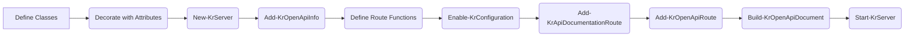

# OpenAPI

Kestrun uses a **code-first** OpenAPI model where PowerShell classes define your data models and attributes define your API specification.

This guide is split into focused pages so readers can learn the basics first, then move into reusable components, routing, callbacks, and runtime enforcement.

## In this section

1. [Beginner](./01-beginner.md)
2. [Components](./02-components.md)
3. [Routing](./03-routing.md)
4. [Advanced](./04-advanced.md)
5. [Callbacks and Webhooks](./05-callbacks.md)
6. [Runtime Contract Enforcement](./06-runtime.md)

> **OpenAPI as a contract (not just docs):** In Kestrun, OpenAPI metadata is used for documentation *and* can participate in runtime enforcement
(content negotiation, request body content types, and parameter/body validation).
This keeps your API definition close to the implementation and lets you leverage PowerShell's type system and validation attributes for a rich OpenAPI contract.

## Typical workflow



## Quick start

```powershell
New-KrServer -Name 'My API'
Add-KrEndpoint -Port 5000

# OpenAPI metadata
Add-KrOpenApiInfo -Title 'My API' -Version '1.0.0'
Add-KrOpenApiServer -Url 'http://127.0.0.1:5000' -Description 'Local'

# Finalize staged configuration
Enable-KrConfiguration

# Expose OpenAPI JSON endpoints
Add-KrOpenApiRoute

# (Optional) Swagger / Redoc UI routes
Add-KrApiDocumentationRoute -DocumentType Swagger
Add-KrApiDocumentationRoute -DocumentType Redoc

# Validate generated output during development/tests
$doc = Build-KrOpenApiDocument
Test-KrOpenApiDocument -Document $doc

Start-KrServer
```

Common URLs when running examples:

- OpenAPI JSON: `/openapi/v3.1/openapi.json`
- Swagger UI: `/docs/swagger`
- ReDoc: `/docs/redoc`
