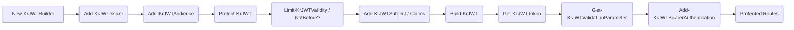

# JSON Web Tokens (JWT)

End-to-end guide for issuing and validating JWT bearer tokens with Kestrun's PowerShell cmdlets.

Focus areas:

- Token builder pipeline (`New-KrJWTBuilder` etc.)
- Adding identity & custom claims
- Protecting payload & headers (signing / integrity)
- Validating tokens on incoming requests
- Renew / refresh patterns
- Security, key management, and common pitfalls

> The PowerShell cmdlets wrap a lightweight internal builder abstraction, not a heavy framework w/ opaque defaults.

---

## 1. Concepts

| Concept        | Description                                                                 |
| -------------- | --------------------------------------------------------------------------- |
| Builder        | Fluent pipeline object that collects header/payload/meta until `Build-KrJWT` |
| Protection     | HMAC (HS256/384/512) or other algorithms configured via `Protect-KrJWT`       |
| Claims         | Standard (sub, name, role) or custom application claims                      |
| Validation     | Parameters (issuer, audience, signing key, clock skew)                       |
| Renewal        | Creating a new token from current context / existing claims                  |
| Lifetime       | Controlled via `Limit-KrJWTValidity` or claim-specific additions             |
| Not Before     | Start time gating via `Limit-KrJWTNotBefore`                                 |

---

## 2. Typical workflow



---

## 3. Minimal issue + validate example

```powershell
# Build configuration
$builder = New-KrJWTBuilder |
  Add-KrJWTIssuer -Issuer 'DemoIssuer' |
  Add-KrJWTAudience -Audience 'DemoAudience' |
  Protect-KrJWT -HexadecimalKey ( -join ((0..63) | ForEach-Object { '{0:x}' -f (Get-Random -Max 16) }) ) -Algorithm HS256 |
  Limit-KrJWTValidity -Minutes 30

$built = $builder | Add-KrJWTSubject -Subject 'user1' | Add-KrJWTClaim -UserClaimType Name -Value 'user1' | Build-KrJWT
$token = $built | Get-KrJWTToken

# Prepare validation parameters (for bearer scheme)
$validation = $built | Get-KrJWTValidationParameter
Add-KrJWTBearerAuthentication -Name 'Bearer' -ValidationParameter $validation
```

---

## 4. Detailed cmdlet pipeline

### 4.1 Create builder

`New-KrJWTBuilder` / legacy alias `New-KrJWTTokenBuilder` returns stateful builder object.

### 4.2 Issuer & audiences

Add one issuer + one or more audiences:

```powershell
$b = New-KrJWTBuilder |
  Add-KrJWTIssuer -Issuer 'IssuerA' |
  Add-KrJWTAudience -Audience 'ClientA' |
  Add-KrJWTAudience -Audience 'ClientB'
```

### 4.3 Protect (sign) the token

Symmetric HMAC (HS256):

```powershell
$b = $b | Protect-KrJWT -HexadecimalKey 'a0b1c2d3e4f5061728394a5b6c7d8e9fa1b2c3d4e5f60718293a4b5c6d7e8f90' -Algorithm HS256
```

Or protect only payload (header left default) via `Protect-KrJWTPayload` (rare; usually use full protection).

### 4.4 Lifetime & temporal claims

```powershell
$b = $b |
  Limit-KrJWTValidity -Minutes 15 |
  Limit-KrJWTNotBefore -Seconds 5 # token not valid for first 5 seconds
```

### 4.5 Subject & claims

Standard helpers:

```powershell
$b = $b |
  Add-KrJWTSubject -Subject 'user42' |
  Add-KrJWTClaim -UserClaimType Name -Value 'user42' |
  Add-KrJWTClaim -UserClaimType Role -Value 'admin'
```

Custom claim type/value:

```powershell
$b = $b | Add-KrJWTClaim -ClaimType 'region' -Value 'us-east-1'
```

### 4.6 Build & extract

```powershell
$result = $b | Build-KrJWT
$jwtString = $result | Get-KrJWTToken
```

`$result` exposes: Issuer, Audience(s), Expires, NotBefore, Algorithm, Claims, Header, Payload.

### 4.7 Validation parameters

```powershell
$validation = $result | Get-KrJWTValidationParameter
Add-KrJWTBearerAuthentication -Name 'Bearer' -ValidationParameter $validation
```

### 4.8 Copy & mutate per-request

```powershell
Copy-KrJWTTokenBuilder -Builder $b |
  Add-KrJWTSubject -Subject $Context.User.Identity.Name |
  Add-KrJWTClaim -UserClaimType Role -Value 'admin' |
  Build-KrJWT | Get-KrJWTToken
```

### 4.9 Updating from existing context

`Update-KrJWT -FromContext` re-creates a token using the existing principal (subject + claims) while applying the same signing key & lifetime rules.

```powershell
$refresh = $b | Update-KrJWT -FromContext
```

### 4.10 Introspection

Decode without validating signature (dev diagnostics):

```powershell
Get-KrJWTInfo -Token $jwtString | Format-List *
```

Validate (signature + lifetime):

```powershell
Test-KrJWT -Token $jwtString -ValidationParameter $validation
```

---

## 5. Putting it together (issue & renew snippet)

```powershell
Add-KrMapRoute -Verbs Get -Pattern '/token/new' -AuthorizationSchema 'BasicInit' -ScriptBlock {
  $build = Copy-KrJWTTokenBuilder -Builder $jwtBuilder |
    Add-KrJWTSubject -Subject $Context.User.Identity.Name |
    Add-KrJWTClaim -UserClaimType Name -Value $Context.User.Identity.Name |
    Add-KrJWTClaim -UserClaimType Role -Value 'admin' |
    Build-KrJWT
  Write-KrJsonResponse @{ access_token = ($build | Get-KrJWTToken); expires = $build.Expires }
}

Add-KrMapRoute -Verbs Get -Pattern '/token/renew' -AuthorizationSchema 'Bearer' -ScriptBlock {
  $newToken = $jwtBuilder | Update-KrJWT -FromContext
  Write-KrJsonResponse @{ access_token = $newToken }
}
```

---

## 6. Security & best practices

- Generate strong keys (32+ bytes for HS256). Store outside source: environment variable, secret manager, Key Vault.
- Rotate keys: maintain overlapping validation (old accept + new issue) windows when rotating.
- Short lifetimes reduce replay risk; pair with refresh mechanism if needed.
- Limit claim size & PII: tokens are often logged/forwarded by proxies. Avoid sensitive identifiers.
- Always validate: issuer, audience, signature, expiration, not-before.
- Use HTTPS: bearer tokens are bearer — possession = access.
- Avoid embedding authorization decisions (e.g., granular permissions) directly; prefer simple roles + server-side policy.
- Clock skew: if clients show premature expiry, add server skew tolerance (future cmdlet may expose this).

---

## 7. Troubleshooting

| Symptom                | Cause                              | Fix                                                    |
| ---------------------- | ---------------------------------- | ------------------------------------------------------ |
| `401 Bearer`           | Missing / invalid token            | Provide `Authorization: Bearer <token>`                |
| Token expired early    | Clock skew / short lifetime        | Increase validity or adjust skew                       |
| Wrong audience error   | Audience mismatch                  | Add correct audience when building / validating        |
| Signature invalid      | Key mismatch / algorithm mismatch  | Ensure same key & algorithm; check hex length          |
| Claims missing         | Builder reused (claims overwritten)| Use `Copy-KrJWTTokenBuilder` for per-request mutation  |
| Renew returns old data | Not using context-based update     | Add `Update-KrJWT -FromContext` or new claim pipeline   |

---

## 8. Cmdlet reference (grouped)

| Category      | Cmdlets                                                                                         |
|---------------|--------------------------------------------------------------------------------------------------|
| Builder       | `New-KrJWTBuilder` (`New-KrJWTTokenBuilder`), `Copy-KrJWTTokenBuilder`                            |
| Identity      | `Add-KrJWTSubject`, `Add-KrJWTClaim`                                                             |
| Protection    | `Protect-KrJWT`, `Protect-KrJWTPayload`                                                          |
| Lifetime      | `Limit-KrJWTValidity`, `Limit-KrJWTNotBefore`                                                    |
| Build/Extract | `Build-KrJWT`, `Get-KrJWTToken`, `Get-KrJWTInfo`                                                 |
| Validate      | `Get-KrJWTValidationParameter`, `Test-KrJWT`, `Add-KrJWTBearerAuthentication`                    |
| Update        | `Update-KrJWT`                                                                                   |

---

## Next

Return to [Guides index](./index) or continue with [Logging](./logging) and
[HTTP Caching](./caching). For usage inside tutorial flows see the Authentication
tutorial’s JWT chapter.

---

_Examples above assume the surrounding server setup (logger, server, listener, runtime, enable configuration) already completed._
